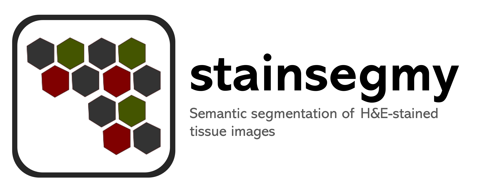

# stainsegmy

<p align="center">
  
</p>

[](https://github.com/qbic-pipelines/nextflow-modules/tree/main/modules/qbic)
[](https://github.com/qbic-pipelines/nextflow-modules/tree/main/subworkflows/qbic)

This repository provides a command-line tool for performing **semantic segmentation on H&E-stained histopathology images** using deep learning models (U-Net variants).

It processes large images via patch extraction, runs model inference, stitches predictions and exports the final segmentation mask as an **OME-TIFF** file.

---

## Features

* Supports multiple architectures:

  * U-Net ([U-Net paper](http://arxiv.org/abs/1505.04597)) ([trained model DOI](https://doi.org/10.5281/zenodo.19631105))
  * U-NeXt ([Influenced from the paper](http://arxiv.org/abs/2201.03545)) ([trained model DOI](https://doi.org/10.5281/zenodo.19631105))
  * Context U-Net (CU-Net) ([Influenced from the paper](http://arxiv.org/abs/1802.10508)) ([trained model DOI](https://doi.org/10.5281/zenodo.7884684))

* Automatic model download from zenodo
* Patch-based inference for large images
* Mask stitching
* OME-TIFF output
* Optional GPU acceleration (CUDA)

### Annotations

All models are trained for a **7-class segmentation task**.

- 0: background
- 1: neutrophil
- 2: epithelial
- 3: lymphocyte
- 4: plasma
- 5: eosinophil
- 6: connective

---

## Installation

Clone the repository:

```
git clone <url>
cd stainsegmy
```

Create a conda environment:

```bash
conda env create -f environment.yml
conda activate stainsegmy-env
```

* For GPU

```bash
pip install torch==2.1.1 torchvision==0.16.1 \
--index-url https://download.pytorch.org/whl/cu118
```

* For CPU

```bash
pip install torch==2.1.1 torchvision==0.16.1
```

Or install as a package:

```
pip install .
```

---

## Expected Input

* Image format: **TIFF / OME-TIFF**
* Shape: **(C, Y, X)** or **(Y, X, C)**
* Channels: **3 (RGB)**

---

## Usage

Run the segmentation pipeline via CLI:

```
python main.py \
  --input path/to/image.tif \
  --output path/to/output_folder \
  --architecture U-Net \
  --cuda
```

### Options

| Option           | Description                             |
| ---------------- | --------------------------------------- |
| `-i, --input`    | Path to input image                     |
| `-o, --output`   | Output directory                        |
| `-m, --model`    | Path to model checkpoint (optional)     |
| `--architecture` | Model type: `U-Net`, `U-NeXt`, `CU-Net` |
| `-c / -nc`       | Enable/disable CUDA                     |
| `-s / -ns`       | Delete downloaded model after prediction|
| `--version`      | Show version                            |

---

## Output

* File: `Segmentation_mask.ome.tif`
* Format: OME-TIFF
* Includes:

  * Class labels

---

## License

This project is licensed under the MIT License. See LICENSE file for details.

---

## Author

This repository is written by Thusheera Kumarasekara and some parts of the project is adapted from the work of Dominik Molitor.

